# GUI PDF Extractor - Architecture Diagrams & Reference

## 1. System Architecture Overview

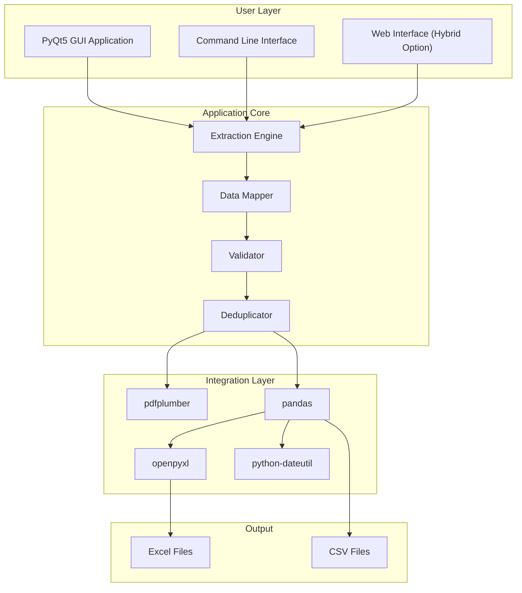

---

## 2. PyQt5 GUI Component Architecture

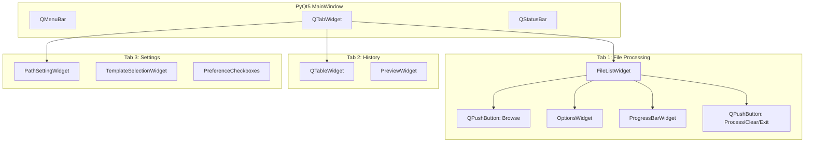

---

## 3. Data Processing Pipeline

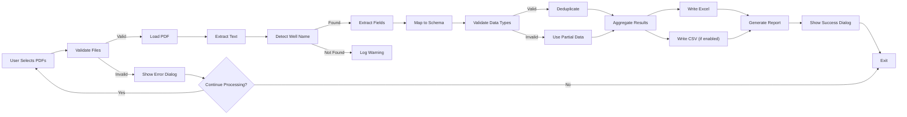

---

## 4. Threading Model for Responsive UI

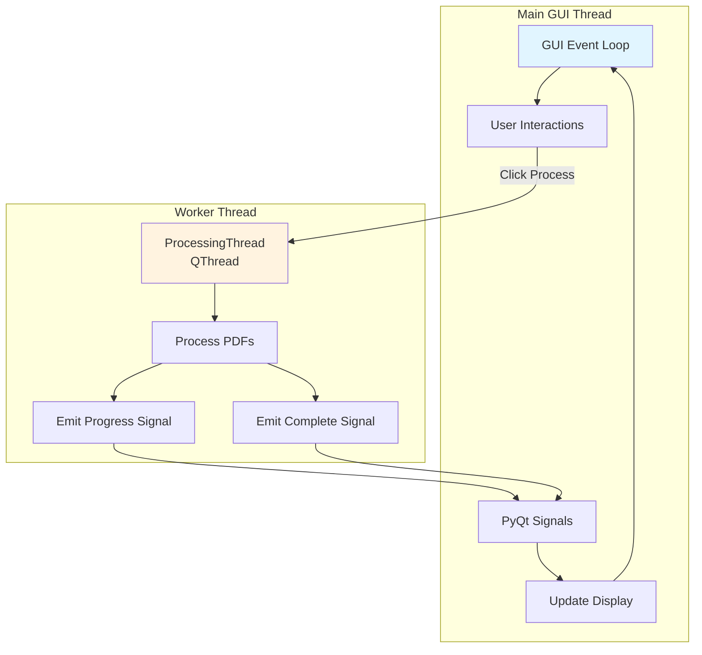

---

## 5. Hybrid Approach: Development vs Deployment

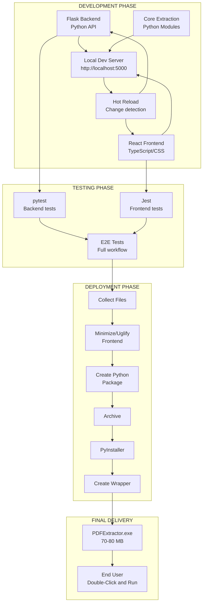

---

## 6. Error Handling Strategy

```mermaid
graph TB
    START["Process PDF"] --> TRY["Try Extract"]
    
    TRY -->|Success| VALIDATE["Validate Data"]
    TRY -->|File Error| CATCH_FILE["Catch: PDFParseError"]
    TRY -->|Other Error| CATCH_OTHER["Catch: Exception"]
    
    CATCH_FILE --> LOG_FILE["Log Error Details"]
    LOG_FILE --> MSG_FILE["Show User Message:<br/>PDF format error"]
    MSG_FILE --> CONTINUE["Continue with Next PDF"]
    
    CATCH_OTHER --> LOG_OTHER["Log Exception<br/>Get Stack Trace"]
    LOG_OTHER --> MSG_OTHER["Show Generic Error:<br/>Unexpected issue"]
    MSG_OTHER --> CONTINUE
    
    VALIDATE -->|Valid| SUCCESS["Add to Results"]
    VALIDATE -->|Invalid| WARN["Log Warning"]
    WARN --> PARTIAL["Use Partial Data"]
    PARTIAL --> SUCCESS
    
    SUCCESS --> NEXT["Next File]
    CONTINUE --> NEXT
    
    NEXT -->|More Files| START
    NEXT -->|Done| REPORT["Generate Report"]
    REPORT --> DISPLAY["Display Summary"]
    
    style CATCH_FILE fill:#ffebee
    style CATCH_OTHER fill:#ffebee
    style SUCCESS fill:#e8f5e9
```

---

## 7. Windows EXE Deployment Architecture

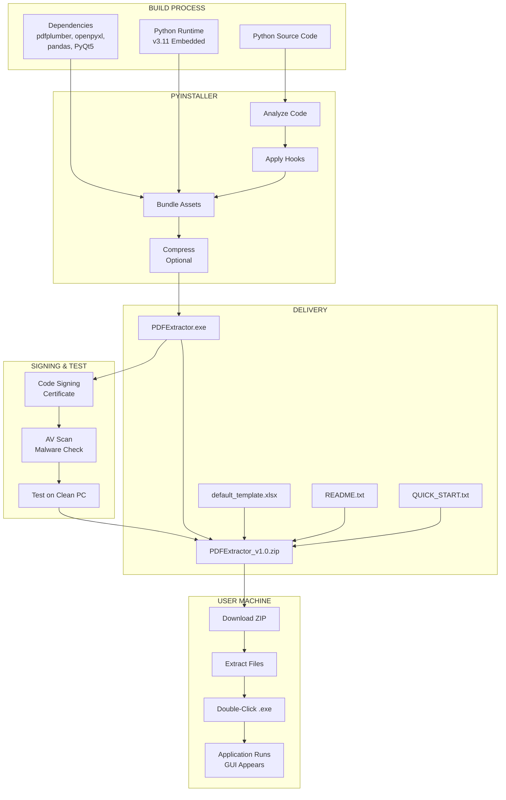

---

## 8. Docker Deployment Architecture

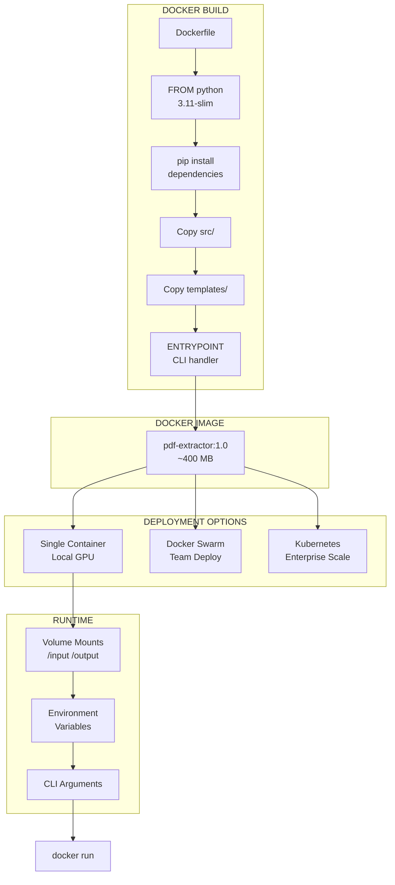

---

## 9. Project File Structure

```
pdf-parser-project/
│
├── src/                           # Application source
│   ├── __init__.py
│   ├── core/                      # Core extraction logic
│   │   ├── pdf_parser.py
│   │   ├── well_detector.py
│   │   └── field_extractor.py
│   ├── data/                      # Data processing
│   │   ├── mapper.py
│   │   ├── validator.py
│   │   ├── deduplicator.py
│   │   └── schemas.py
│   ├── output/                    # Output generation
│   │   ├── excel_writer.py
│   │   ├── csv_writer.py
│   │   └── file_manager.py
│   ├── gui/                       # PyQt5 GUI
│   │   ├── application.py
│   │   ├── main_window.py
│   │   ├── dialogs/
│   │   ├── widgets/
│   │   └── styles/
│   ├── cli/                       # Command-line
│   │   └── cli.py
│   └── utils/                     # Utilities
│       ├── logger.py
│       ├── config.py
│       └── exceptions.py
│
├── tests/                         # Test suite
│   ├── unit/
│   ├── integration/
│   └── fixtures/
│
├── build/                         # Build configurations
│   ├── windows/                   # PyInstaller
│   │   ├── build.spec
│   │   └── build_exe.bat
│   └── docker/                    # Docker
│       ├── Dockerfile
│       └── docker-compose.yml
│
├── templates/                     # Excel templates
│   └── default_template.xlsx
│
├── docs/                          # Documentation
├── requirements/                  # Dependencies
└── config/                        # Configuration
```

---

## 10. User Workflow State Machine

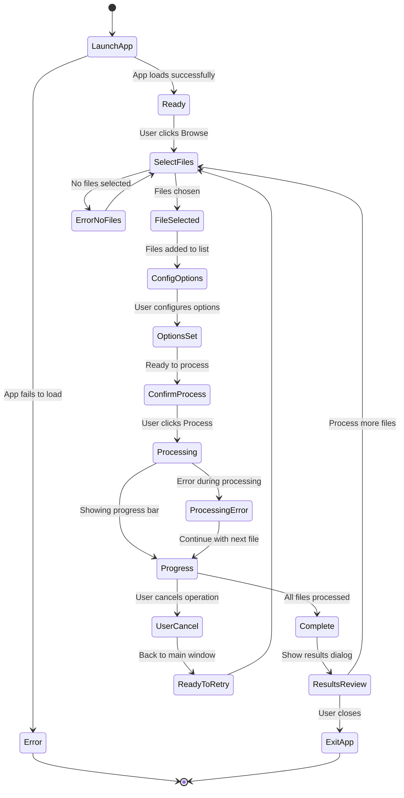

---

## 11. Development Task Dependency Graph

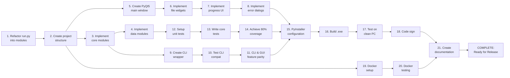

---

## 12. PyQt5 Signal/Slot Communication Pattern

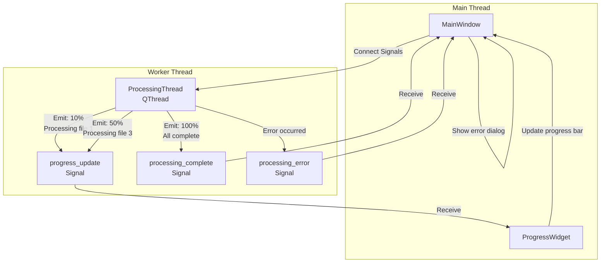

---

## 13. Data Model Relationships

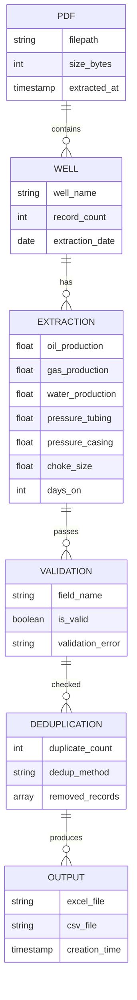

---

## 14. Performance Metrics & Targets

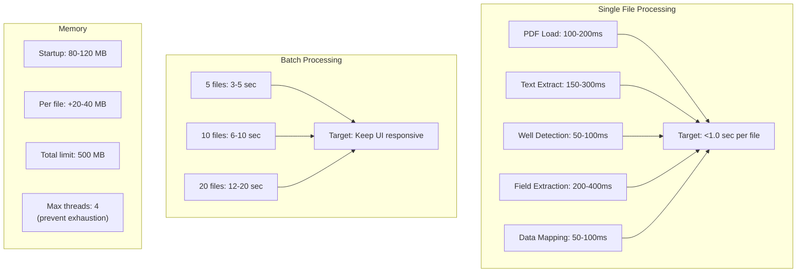

---

## 15. Risk Mitigation Roadmap

```mermaid
graph TB
    subgraph "RISK 1: PyQt5 Complexity"
        R1_PROBLEM["Steep learning curve"]
        R1_MITIGATION["Use template patterns<br/>Keep UI separate<br/>Good documentation"]
        R1_MONITOR["Code review<br/>Unit tests"]
    end
    
    subgraph "RISK 2: .exe Antivirus"
        R2_PROBLEM["Flagged as malware"]
        R2_MITIGATION["Code signing cert<br/>Reputable build process<br/>Community reporting"]
        R2_MONITOR["Test with VirusTotal<br/>Defender scan"]
    end
    
    subgraph "RISK 3: PDF Parsing"
        R3_PROBLEM["Edge case failures"]
        R3_MITIGATION["Test samples<br/>Error handling<br/>Logging & diagnostics"]
        R3_MONITOR["User reports<br/>Log analysis"]
    end
    
    subgraph "RISK 4: Performance"
        R4_PROBLEM["Slow batch processing"]
        R4_MITIGATION["Threading<br/>Batch limits<br/>Memory mgmt"]
        R4_MONITOR["Performance tests<br/>User feedback"]
    end
    
    R1_PROBLEM --> R1_MITIGATION
    R1_MITIGATION --> R1_MONITOR
    
    R2_PROBLEM --> R2_MITIGATION
    R2_MITIGATION --> R2_MONITOR
    
    R3_PROBLEM --> R3_MITIGATION
    R3_MITIGATION --> R3_MONITOR
    
    R4_PROBLEM --> R4_MITIGATION
    R4_MITIGATION --> R4_MONITOR
```

---

## Key Takeaways from Diagrams

1. **System Architecture**: Clear separation between GUI, Core Logic, and Integration layers
2. **Threading**: Worker threads keep GUI responsive during long operations
3. **Error Handling**: Graceful degradation - one file's error doesn't stop batch
4. **Deployment**: PyInstaller creates single .exe with all dependencies bundled
5. **Hybrid Approach**: Flask + React frontend offers faster development iteration
6. **Testing**: Comprehensive unit tests and integration tests at each phase
7. **User Experience**: State machine ensures logical workflow and error recovery
8. **Performance**: Threading limits and batch processing prevent resource exhaustion

All diagrams are compatible with both PyQt5 Desktop and Hybrid (Flask+React) approaches.

