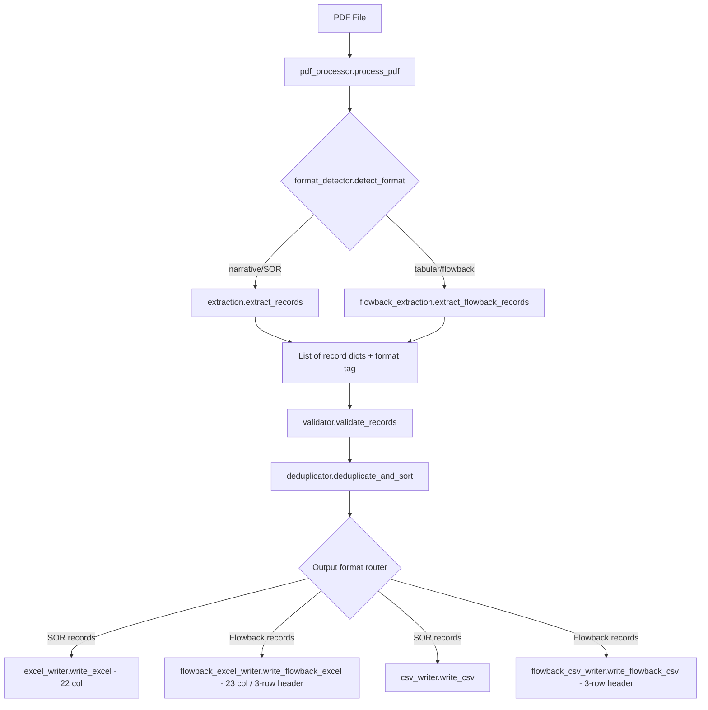
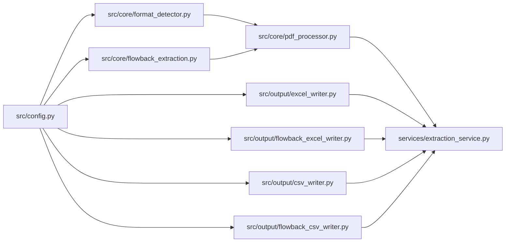
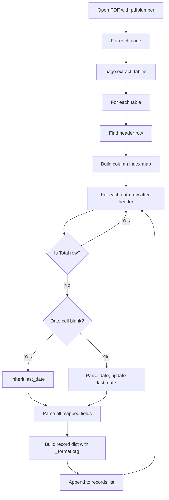

# Flowback Report PDF Format Support — Implementation Plan

## 1. Overview

This plan adds support for extracting production data from **tabular "Flowback Report" PDFs** (e.g., UL Carla) alongside the existing **narrative/SOR format** PDFs. The system will auto-detect the PDF format and route to the appropriate extraction strategy, producing format-specific output with the correct column layout and headers.

### Design Principles

- **Strategy Pattern** — A common interface for extraction, with format-specific implementations
- **Zero regression** — All existing SOR tests and behavior remain untouched
- **Format isolation** — Each format defines its own config (column map, fields, headers)
- **Single pipeline** — The validator, deduplicator, and service layer remain format-agnostic; format metadata travels with the records

---

## 2. Architecture

### 2.1 High-Level Flow



### 2.2 Module Dependency Map



---

## 3. Format Detection Module

### File: [`src/core/format_detector.py`](src/core/format_detector.py) — **NEW**

Determines whether a PDF is narrative/SOR or tabular/flowback by inspecting the first page.

```python
"""PDF format detection module."""

from enum import Enum
from typing import Optional
import pdfplumber
from pathlib import Path

from src.config import get_logger

logger = get_logger(__name__)


class PDFFormat(Enum):
    """Supported PDF extraction formats."""
    NARRATIVE_SOR = "narrative_sor"
    TABULAR_FLOWBACK = "tabular_flowback"


# Header keywords that identify a flowback-format table
FLOWBACK_HEADER_KEYWORDS = [
    "Unit Name",
    "New Prod Oil",
    "New Prod Gas",
    "Cum. Oil",
    "ESP Pump Intake",
    "Gas Lift Inj",
    "Tubing Choke",
]

# Minimum number of keyword matches to classify as flowback
FLOWBACK_KEYWORD_THRESHOLD = 3


def detect_format(pdf_path: Path) -> PDFFormat:
    """
    Detect whether a PDF is narrative/SOR or tabular/flowback format.

    Strategy (applied to the first page only):
      1. Attempt pdfplumber.extract_tables() — if it returns a non-empty
         list with at least one table having >= 10 columns, check headers.
      2. If the first table row contains >= FLOWBACK_KEYWORD_THRESHOLD
         of the FLOWBACK_HEADER_KEYWORDS, classify as TABULAR_FLOWBACK.
      3. Otherwise, classify as NARRATIVE_SOR.

    Args:
        pdf_path: Path to the PDF file

    Returns:
        PDFFormat enum value
    """
    ...


def _check_table_headers(
    header_row: list,
    keywords: list[str],
    threshold: int,
) -> bool:
    """
    Check if a table header row contains enough flowback keywords.

    Args:
        header_row: List of cell values from the first row of a table
        keywords: Flowback header keywords to search for
        threshold: Minimum matches required

    Returns:
        True if the header row matches the flowback format
    """
    ...
```

#### Detection Logic Detail

1. Open PDF, get `page = pdf.pages[0]`
2. Call `page.extract_tables()` — returns `List[List[List[str]]]`
3. If tables exist and the widest table has ≥ 10 columns:
   - Join all cell values of row 0 into a single string
   - Count how many `FLOWBACK_HEADER_KEYWORDS` appear (case-insensitive substring match)
   - If count ≥ `FLOWBACK_KEYWORD_THRESHOLD` → `TABULAR_FLOWBACK`
4. Fall back to `NARRATIVE_SOR`

This approach is resilient: a garbled narrative PDF will never accidentally have a 10+ column table whose headers match flowback keywords.

---

## 4. Config Updates

### File: [`src/config.py`](src/config.py:1) — **MODIFIED**

Add a new section below the existing `COL_MAP` for the flowback output format. The existing SOR constants remain **unchanged**.

#### 4.1 New Constants to Add

```python
# ========================= FLOWBACK FORMAT CONFIG =========================

# PDFFormat enum is defined in src/core/format_detector.py but we store
# format-specific column maps and field lists here for central config.

FLOWBACK_COL_MAP = {
    'Name': 1,                           # A — Well/Unit Name
    'Date': 2,                           # B — Date
    'qo': 3,                             # C — Stock Tank Oil (STB/d)
    'qg': 4,                             # D — Stock Tank Gas (Mscf/d)
    'qw': 5,                             # E — Stock Tank Water (STB/d)
    'qo_sep': 6,                         # F — Separator Oil
    'qg_sep': 7,                         # G — Separator Gas
    'qw_sep': 8,                         # H — Separator Water
    'psep': 9,                           # I — Separator Pressure
    'Tsep': 10,                          # J — Separator Temperature
    'pwf': 11,                           # K — BHP / ESP Pump Intake
    'ptubing': 12,                       # L — Tubing Pressure
    'pcasing': 13,                       # M — Casing Pressure
    'qg_gas_lift': 14,                   # N — Gas Lift Injection
    'liquid_level_md': 15,               # O — Liquid Level MD
    'line_pressure': 16,                 # P — Line Pressure
    'choke_size': 17,                    # Q — Choke Size (1/64")
    'sand_rate': 18,                     # R — Sand Rate
    'power_fluid_rate': 19,              # S — Power Fluid Rate
    'power_fluid_surface_pressure': 20,  # T — Power Fluid Surface Pressure
    'esp_frequency': 21,                 # U — ESP Frequency (Hz)
    'days_on': 22,                       # V — Days On
    'comment': 23,                       # W — Comment
}

# 3-row header structure for flowback Excel output
# Row 1: Group headers (merged cells span multiple columns)
FLOWBACK_HEADER_ROW_1 = {
    1:  'Well',
    2:  'Time',
    3:  'Stock Tank Rates',    # spans C-E
    6:  'Separator Rates and Conditions',  # spans F-J
    11: 'Measured Pressures and Gas-Lift Rates',  # spans K-N
    15: 'BHP Jet Pump',       # spans O-T
    21: '',                    # ESP Frequency — no group
    22: '',                    # Days On — no group
    23: '',                    # Comment — no group
}

# Row 1 merge ranges: (start_col, end_col) for merged group headers
FLOWBACK_HEADER_MERGES_ROW_1 = [
    (3, 5),    # Stock Tank Rates: C-E
    (6, 10),   # Separator Rates and Conditions: F-J
    (11, 14),  # Measured Pressures and Gas-Lift Rates: K-N
    (15, 20),  # BHP Jet Pump: O-T
]

# Row 2: Field name headers
FLOWBACK_HEADER_ROW_2 = {
    1:  'Name',
    2:  'Date',
    3:  'qo',
    4:  'qg',
    5:  'qw',
    6:  'qo,sep',
    7:  'qg,sep',
    8:  'qw,sep',
    9:  'psep',
    10: 'Tsep',
    11: 'pwf',
    12: 'ptubing',
    13: 'pcasing',
    14: 'qg,gas lift',
    15: 'Liquid Level MD',
    16: 'Line Pressure',
    17: 'Choke Size',
    18: 'Sand Rate',
    19: 'Power Fluid Rate',
    20: 'Power Fluid Surface Pressure',
    21: 'ESP Frequency',
    22: 'Days On',
    23: 'Comment',
}

# Row 3: Units
FLOWBACK_HEADER_ROW_3 = {
    1:  '-',
    2:  '-',
    3:  'STB/d',
    4:  'Mscf/d',
    5:  'STB/d',
    6:  'sep-bbl/d',
    7:  'Mscf/d',
    8:  'sep-bbl/d',
    9:  'psia',
    10: 'F',
    11: 'psia',
    12: 'psia',
    13: 'psia',
    14: 'Mscf/d',
    15: 'ft',
    16: 'psia',
    17: 'in/64',
    18: 'lbm/d',
    19: 'STB/d',
    20: 'psia',
    21: 'Hz',
    22: '#',
    23: 'Text',
}

# Data starts at row 4 (same as SOR — rows 1-3 are headers)
FLOWBACK_START_ROW = 4

# Expected fields in flowback records
FLOWBACK_EXPECTED_FIELDS = [
    'Name',
    'Date',
    'qo',
    'qg',
    'qw',
    'qo_sep',
    'qg_sep',
    'qw_sep',
    'psep',
    'Tsep',
    'pwf',
    'ptubing',
    'pcasing',
    'qg_gas_lift',
    'liquid_level_md',
    'line_pressure',
    'choke_size',
    'sand_rate',
    'power_fluid_rate',
    'power_fluid_surface_pressure',
    'esp_frequency',
    'days_on',
    'comment',
]

# Required fields for flowback validation
FLOWBACK_REQUIRED_FIELDS = ['Name', 'Date']

# Numeric fields for flowback validation
FLOWBACK_NUMERIC_FIELDS = [
    'qo', 'qg', 'qw', 'ptubing', 'pcasing',
    'pwf', 'qg_gas_lift', 'choke_size', 'esp_frequency', 'days_on',
]

# Mapping from UL Carla PDF table headers to internal field names
# This maps the column header text in the PDF table to our record dict keys
FLOWBACK_PDF_COLUMN_MAP = {
    'Date': 'Date',
    'Unit Name': 'Name',
    'Days On': 'days_on',
    'Prod Method': None,          # Not mapped to output
    'New Prod Oil': 'qo',         # bbl → STB/d
    'New Prod Gas': 'qg',         # MCF → Mscf/d
    'New Prod Wat': 'qw',         # bbl → STB/d
    'Cum. Oil': None,             # Cumulative — not mapped
    'Cum. Gas': None,             # Cumulative — not mapped
    'Cum. Water': None,           # Cumulative — not mapped
    'Tubing': 'ptubing',          # psi
    'Casing': 'pcasing',          # psi
    'ESP Pump Intake': 'pwf',     # psi
    'ESP Speed': 'esp_frequency', # Hz
    'Gas Lift Inj': 'qg_gas_lift',# MCF
    'Tubing Choke': 'choke_size', # 1/64"
    'Down Time': None,            # Not mapped
    'Down Reason': None,          # Not mapped
    'Comment': 'comment',
}
```

#### 4.2 Format-Aware Helper

```python
def get_format_config(format_type: str) -> dict:
    """
    Return col_map, expected_fields, required_fields, numeric_fields,
    and start_row for the given format type.

    Args:
        format_type: 'narrative_sor' or 'tabular_flowback'

    Returns:
        Dict with keys: col_map, expected_fields, required_fields,
                        numeric_fields, start_row
    """
    ...
```

---

## 5. Flowback Extraction Module

### File: [`src/core/flowback_extraction.py`](src/core/flowback_extraction.py) — **NEW**

This module handles table-based extraction from flowback PDFs using `pdfplumber.extract_tables()`.

```python
"""
Flowback Report PDF extraction module.
Extracts production records from tabular PDFs using pdfplumber table extraction.
"""

import re
from datetime import date
from typing import Dict, List, Any, Optional

import pdfplumber
from dateutil import parser as date_parser
from pathlib import Path

from src.config import (
    get_logger,
    FLOWBACK_PDF_COLUMN_MAP,
)

logger = get_logger(__name__)


def extract_flowback_records(pdf_path: Path) -> List[Dict[str, Any]]:
    """
    Extract production records from a tabular flowback PDF.

    Process:
      1. Open PDF with pdfplumber
      2. For each page, call page.extract_tables()
      3. Identify header row by matching known column names
      4. Map columns to internal field names via FLOWBACK_PDF_COLUMN_MAP
      5. For each data row:
         a. Skip Total/summary rows
         b. Propagate date from most recent non-blank date row
         c. Parse numeric values (strip commas)
         d. Build record dict
      6. Tag each record with _format = 'tabular_flowback'

    Args:
        pdf_path: Path to the flowback PDF file

    Returns:
        List of record dicts with 'Name', 'Date', 'qo', etc.
        Each record also contains '_format': 'tabular_flowback'
    """
    ...


def _identify_header_row(
    table: List[List[Optional[str]]],
) -> Optional[int]:
    """
    Find the row index in a table that contains the column headers.

    Scans rows looking for cells matching keys in FLOWBACK_PDF_COLUMN_MAP.

    Args:
        table: 2D list of cell values from pdfplumber

    Returns:
        Row index of the header row, or None if not found
    """
    ...


def _build_column_index(
    header_row: List[Optional[str]],
) -> Dict[str, int]:
    """
    Build a mapping from internal field name to column index.

    Uses FLOWBACK_PDF_COLUMN_MAP to translate PDF header text
    to record dict keys.

    Args:
        header_row: List of header cell values

    Returns:
        Dict mapping field_name -> column_index
    """
    ...


def _is_total_row(row: List[Optional[str]], name_col_idx: int) -> bool:
    """
    Detect if this row is a 'Total' summary row that should be filtered.

    Args:
        row: List of cell values
        name_col_idx: Column index for the Unit Name field

    Returns:
        True if this is a Total row
    """
    ...


def _parse_numeric(value: Optional[str]) -> Optional[int]:
    """
    Parse a numeric string, stripping commas and whitespace.

    Args:
        value: Raw cell value like '1,041' or '80'

    Returns:
        Integer value, or None if empty/unparseable
    """
    ...


def _parse_date(value: Optional[str]) -> Optional[date]:
    """
    Parse a date string in M/D/YYYY format.

    Args:
        value: Raw date string like '2/24/2026'

    Returns:
        date object, or None if empty/unparseable
    """
    ...
```

### Extraction Algorithm Detail



Key behaviors:
- **Date propagation**: Maintain a `last_date` variable per page. When a row's Date cell is blank/None, use `last_date`. When non-blank, parse and update `last_date`.
- **Total row filtering**: If the "Unit Name" cell contains "Total" (case-insensitive), skip the row.
- **Format tag**: Every record gets `_format: 'tabular_flowback'` so downstream modules can route correctly.
- **Multi-table pages**: If a page has multiple tables, process each independently (re-detect headers).

---

## 6. PDF Processor Updates

### File: [`src/core/pdf_processor.py`](src/core/pdf_processor.py:1) — **MODIFIED**

The processor becomes a router: detect format first, then dispatch to the appropriate extraction function.

#### Changes

```python
# New imports at top
from src.core.format_detector import detect_format, PDFFormat
from src.core.flowback_extraction import extract_flowback_records


def process_pdf(pdf_path: Path) -> List[Dict[str, Any]]:
    """
    Process a single PDF file and extract production records.

    Updated pipeline:
    1. Detect PDF format (narrative vs tabular)
    2. Route to appropriate extraction function
    3. Tag records with format metadata

    Args:
        pdf_path: Path to the PDF file

    Returns:
        List of record dicts. Each dict includes '_format' key.
    """
    pdf_path = Path(pdf_path)
    logger.info(f"Processing {pdf_path.name}")

    if not pdf_path.exists():
        raise FileNotFoundError(f"PDF file not found: {pdf_path}")

    # Step 1: Detect format
    pdf_format = detect_format(pdf_path)
    logger.info(f"  Detected format: {pdf_format.value}")

    # Step 2: Route to extraction strategy
    if pdf_format == PDFFormat.TABULAR_FLOWBACK:
        records = extract_flowback_records(pdf_path)
    else:
        # Existing narrative/SOR extraction
        text = ""
        with pdfplumber.open(pdf_path) as pdf:
            for page_num, page in enumerate(pdf.pages, 1):
                page_text = page.extract_text() or ""
                text += "\n" + page_text
                logger.debug(f"  Extracted text from page {page_num}")

        well_name = extract_well_name(text)
        records = extract_records(text, well_name)

        # Tag SOR records with format
        for rec in records:
            rec['_format'] = 'narrative_sor'

    logger.info(f"  → {len(records)} records extracted")
    return records
```

The key change is that [`process_pdf()`](src/core/pdf_processor.py:16) now:
1. Calls [`detect_format()`](src/core/format_detector.py) before any extraction
2. Branches to [`extract_flowback_records()`](src/core/flowback_extraction.py) for tabular PDFs
3. Falls through to existing [`extract_records()`](src/core/extraction.py:58) for narrative PDFs
4. Adds `_format` tag to all records

---

## 7. Validator Updates

### File: [`src/data/validator.py`](src/data/validator.py:1) — **MODIFIED**

The validator needs to support both field schemas.

#### Changes

1. [`validate_record()`](src/data/validator.py:18) — Accept a `format_type` parameter (defaulting to `'narrative_sor'`), or auto-detect from `record.get('_format')`:

```python
def validate_record(record: Dict[str, Any]) -> Tuple[bool, List[str]]:
    """
    Validate a single production record.
    Auto-detects format from record['_format'] and uses the appropriate
    required_fields and numeric_fields lists.
    """
    errors = []
    fmt = record.get('_format', 'narrative_sor')

    if fmt == 'tabular_flowback':
        required = FLOWBACK_REQUIRED_FIELDS
        numeric = FLOWBACK_NUMERIC_FIELDS
    else:
        required = REQUIRED_FIELDS
        numeric = NUMERIC_FIELDS

    # Check required fields
    for field in required:
        if field not in record:
            errors.append(f"Missing required field: {field}")
        elif record[field] is None:
            errors.append(f"Required field is None: {field}")

    # Check date type
    if "Date" in record and record["Date"] is not None:
        if not isinstance(record["Date"], date):
            errors.append(f"Date field is not a date object: {type(record['Date'])}")

    # Check numeric fields
    for field in numeric:
        if field in record and record[field] is not None:
            if not isinstance(record[field], (int, float)):
                errors.append(f"Numeric field {field} is not numeric: {type(record[field])}")

    # Non-negative production checks
    for prod_field in ['qo', 'qg', 'qw']:
        if prod_field in record and record[prod_field] is not None:
            if record[prod_field] < 0:
                errors.append(f"Production field {prod_field} cannot be negative")

    is_valid = len(errors) == 0
    if not is_valid:
        logger.warning(f"Record validation failed: {errors}")
    return is_valid, errors
```

2. [`check_record_completeness()`](src/data/validator.py:120) — Use format-aware expected fields:

```python
def check_record_completeness(record: Dict[str, Any]) -> Dict[str, Any]:
    fmt = record.get('_format', 'narrative_sor')
    expected = FLOWBACK_EXPECTED_FIELDS if fmt == 'tabular_flowback' else EXPECTED_FIELDS
    # ... rest unchanged, just uses `expected` instead of EXPECTED_FIELDS
```

New imports needed at top:
```python
from src.config import (
    ...,
    FLOWBACK_REQUIRED_FIELDS,
    FLOWBACK_NUMERIC_FIELDS,
    FLOWBACK_EXPECTED_FIELDS,
)
```

---

## 8. Deduplicator Updates

### File: [`src/data/deduplicator.py`](src/data/deduplicator.py:1) — **MODIFIED (minimal)**

The deduplicator sorts by `(Well, Date)` but flowback records use `Name` instead of `Well`.

#### Changes

[`deduplicate_and_sort()`](src/data/deduplicator.py:14) — Normalize the name column before dedup:

```python
def deduplicate_and_sort(records: List[Dict[str, Any]]) -> pd.DataFrame:
    if not records:
        return pd.DataFrame()

    df = pd.DataFrame(records)

    # Normalize: flowback uses 'Name', SOR uses 'Well'
    # Create a unified sort key
    if 'Name' in df.columns and 'Well' not in df.columns:
        df['Well'] = df['Name']
    elif 'Name' in df.columns and 'Well' in df.columns:
        # Mixed batch — fill Well from Name where Well is missing
        df['Well'] = df['Well'].fillna(df['Name'])

    initial_count = len(df)
    df = df.drop_duplicates(subset=None, keep='first')
    # ... rest unchanged
```

> **Alternative approach**: Instead of normalizing in the deduplicator, the flowback extraction module could output `'Well'` as the key name (mapped from `Unit Name`), and additionally output `'Name'` for the output column. This keeps the deduplicator simpler. **Recommended: use `'Well'` in extraction, alias to `'Name'` only at output time.**

#### Recommended Approach (cleaner)

In [`flowback_extraction.py`](src/core/flowback_extraction.py), store the unit name as **both** `'Well'` (for pipeline compatibility) and `'Name'` (for output mapping):

```python
record = {
    'Well': unit_name,   # Pipeline-compatible key (dedup, sort)
    'Name': unit_name,   # Output key for flowback column map
    ...
}
```

This way [`deduplicate_and_sort()`](src/data/deduplicator.py:14) requires **zero changes** — it already sorts on `(Well, Date)`.

---

## 9. Output Writer Updates

### 9.1 Flowback Excel Writer

### File: [`src/output/flowback_excel_writer.py`](src/output/flowback_excel_writer.py) — **NEW**

Writes the 23-column, 3-row-header Excel format for flowback data.

```python
"""
Flowback Excel output writer.
Produces the 3-row header, 23-column format for flowback reports.
"""

from datetime import datetime
from pathlib import Path
from typing import Union, Optional

import pandas as pd
from openpyxl import Workbook
from openpyxl.styles import Font, Alignment
from openpyxl.utils import get_column_letter

from src.config import (
    get_logger,
    FLOWBACK_COL_MAP,
    FLOWBACK_HEADER_ROW_1,
    FLOWBACK_HEADER_ROW_2,
    FLOWBACK_HEADER_ROW_3,
    FLOWBACK_HEADER_MERGES_ROW_1,
    FLOWBACK_START_ROW,
)

logger = get_logger(__name__)


def write_flowback_excel(
    df: pd.DataFrame,
    output_path: Union[str, Path],
) -> Path:
    """
    Write flowback data to Excel with 3-row header structure.

    Header layout:
      Row 1: Group headers (merged cells)
      Row 2: Field names
      Row 3: Units
      Row 4+: Data

    Args:
        df: DataFrame with flowback records
        output_path: Path to write the Excel file

    Returns:
        Path to written file
    """
    ...


def _write_header_rows(ws) -> None:
    """
    Write the 3-row header structure with merged cells and formatting.

    Args:
        ws: openpyxl Worksheet
    """
    ...


def _write_data_rows(ws, df: pd.DataFrame) -> None:
    """
    Write data rows starting at FLOWBACK_START_ROW.

    Maps DataFrame columns to Excel columns using FLOWBACK_COL_MAP.

    Args:
        ws: openpyxl Worksheet
        df: DataFrame with flowback records
    """
    ...
```

#### Header Writing Detail

1. **Row 1** — Write group headers from `FLOWBACK_HEADER_ROW_1`, then merge cells per `FLOWBACK_HEADER_MERGES_ROW_1`. Apply bold + center alignment.
2. **Row 2** — Write field names from `FLOWBACK_HEADER_ROW_2`. Apply bold.
3. **Row 3** — Write units from `FLOWBACK_HEADER_ROW_3`. Apply italic.
4. **Data rows** — Iterate `df` rows, write each value to the column specified by `FLOWBACK_COL_MAP`.

### 9.2 Flowback CSV Writer

### File: [`src/output/flowback_csv_writer.py`](src/output/flowback_csv_writer.py) — **NEW**

```python
"""
Flowback CSV output writer.
Produces CSV with 3-row header matching the Excel format.
"""

import csv
from pathlib import Path
from typing import Union, Optional

import pandas as pd

from src.config import (
    get_logger,
    FLOWBACK_COL_MAP,
    FLOWBACK_HEADER_ROW_1,
    FLOWBACK_HEADER_ROW_2,
    FLOWBACK_HEADER_ROW_3,
)

logger = get_logger(__name__)


def write_flowback_csv(
    df: pd.DataFrame,
    output_path: Union[str, Path],
) -> Path:
    """
    Write flowback data to CSV with 3-row header.

    Row 1: Group headers
    Row 2: Field names
    Row 3: Units
    Row 4+: Data

    Args:
        df: DataFrame with flowback records
        output_path: Path to write the CSV file

    Returns:
        Path to written file
    """
    ...
```

### 9.3 Existing Writer Changes

[`src/output/excel_writer.py`](src/output/excel_writer.py:1) and [`src/output/csv_writer.py`](src/output/csv_writer.py:1) — **NO CHANGES REQUIRED**. They continue to handle SOR format output as-is.

---

## 10. Extraction Service Updates

### File: [`services/extraction_service.py`](services/extraction_service.py:1) — **MODIFIED**

The service needs to detect the format of the processed records and route to the correct output writers.

#### Changes to [`process_job()`](services/extraction_service.py:396)

After deduplication, determine the output format from the `_format` tag on records, then dispatch:

```python
# New imports
from src.output.flowback_excel_writer import write_flowback_excel
from src.output.flowback_csv_writer import write_flowback_csv
from src.core.format_detector import PDFFormat


def process_job(self, job_id, template_path=None):
    # ... existing code up to dedup ...

    df = deduplicate_and_sort(valid_records)

    # Determine output format from records
    # If ALL records are flowback, use flowback output
    # If ALL records are SOR, use SOR output
    # If mixed, separate into two DataFrames and write both
    format_tags = df['_format'].unique() if '_format' in df.columns else ['narrative_sor']

    excel_output_path = self.output_folder / f"{job_id}_output.xlsx"
    csv_output_path = self.output_folder / f"{job_id}_output.csv"

    if len(format_tags) == 1 and format_tags[0] == 'tabular_flowback':
        # Pure flowback batch
        write_flowback_excel(df, excel_output_path)
        write_flowback_csv(df, csv_output_path)
    elif len(format_tags) == 1:
        # Pure SOR batch (existing logic)
        # ... existing template/write_excel logic ...
        write_csv(df, csv_output_path)
    else:
        # Mixed batch — write SOR and flowback as separate sheets/files
        # Write SOR records
        df_sor = df[df['_format'] == 'narrative_sor'].copy()
        df_fb = df[df['_format'] == 'tabular_flowback'].copy()

        # Primary output uses the majority format; secondary gets a suffix
        # For simplicity: write the larger set as the primary output
        if len(df_fb) >= len(df_sor):
            write_flowback_excel(df_fb, excel_output_path)
            write_flowback_csv(df_fb, csv_output_path)
            # Optionally write SOR as secondary file
            if not df_sor.empty:
                sor_xlsx = self.output_folder / f"{job_id}_sor_output.xlsx"
                sor_csv = self.output_folder / f"{job_id}_sor_output.csv"
                # ... write SOR outputs ...
        else:
            # ... inverse ...

    # ... rest of completion logic ...
```

> **Note on mixed batches**: The most common use case is a batch of PDFs all in the same format. Mixed batches are an edge case. The simplest first implementation is to error if formats are mixed, with a clear message: "Cannot process mixed PDF formats in a single batch. Please upload SOR and Flowback PDFs separately." This can be relaxed later.

#### Recommended Mixed-Batch Strategy (Phase 1)

```python
if len(format_tags) > 1:
    raise ProcessingError(
        "Mixed PDF formats detected. Please upload SOR and Flowback PDFs in separate batches."
    )
```

---

## 11. CLI Updates

### File: [`cli.py`](cli.py:1) — **MODIFIED**

Add format-aware output routing to the CLI pipeline.

#### Changes

```python
# New imports
from src.output.flowback_excel_writer import write_flowback_excel
from src.output.flowback_csv_writer import write_flowback_csv


def main():
    # ... existing arg parsing and PDF processing ...

    # After dedup:
    df = deduplicate_and_sort(valid_records)

    # Determine format
    format_tags = df['_format'].unique() if '_format' in df.columns else ['narrative_sor']

    if len(format_tags) > 1:
        logger.error("Mixed PDF formats detected. Please separate SOR and Flowback PDFs.")
        return 1

    is_flowback = format_tags[0] == 'tabular_flowback'

    if is_flowback:
        # Flowback output — no template needed
        excel_output = write_flowback_excel(df, args.output)
        csv_output = write_flowback_csv(df, args.csv)
    else:
        # Existing SOR output
        if template_path.exists():
            excel_output = write_excel(df, template_path, args.output)
        else:
            excel_output = None
        csv_output = write_csv_with_formatting(df, args.csv)

    # ... existing summary reporting ...
```

---

## 12. Test Plan

### 12.1 New Test Files

| Test File | Covers |
|-----------|--------|
| `tests/backend/unit/test_format_detector.py` | [`detect_format()`](src/core/format_detector.py), [`_check_table_headers()`](src/core/format_detector.py) |
| `tests/backend/unit/test_flowback_extraction.py` | [`extract_flowback_records()`](src/core/flowback_extraction.py), date propagation, Total row filtering, numeric parsing |
| `tests/backend/unit/test_flowback_excel_writer.py` | 3-row header, merged cells, data mapping |
| `tests/backend/unit/test_flowback_csv_writer.py` | 3-row header CSV output |
| `tests/backend/integration/test_flowback_pipeline.py` | End-to-end: flowback PDF → records → validate → dedup → Excel/CSV |

### 12.2 Existing Tests — Regression

All existing tests in `tests/backend/unit/` and `tests/backend/integration/` must continue to pass. The `_format` tag on SOR records is the only change visible to existing code paths, and existing tests should be updated to either:
- Ignore the `_format` key, or
- Assert that SOR records carry `_format: 'narrative_sor'`

### 12.3 Test Data Strategy

Since real flowback PDFs may not be available in the repo, tests should:
1. **Mock `pdfplumber`** — Provide fake table data matching the expected structure
2. **Use fixture data** — JSON fixtures representing extracted table arrays
3. **Optionally**: Include a sample flowback PDF in `tests/fixtures/` if licensing permits

---

## 13. File-by-File Change Summary

| File | Action | Key Changes |
|------|--------|-------------|
| [`src/config.py`](src/config.py:1) | **Modify** | Add `FLOWBACK_COL_MAP`, `FLOWBACK_HEADER_ROW_1/2/3`, `FLOWBACK_HEADER_MERGES_ROW_1`, `FLOWBACK_START_ROW`, `FLOWBACK_EXPECTED_FIELDS`, `FLOWBACK_REQUIRED_FIELDS`, `FLOWBACK_NUMERIC_FIELDS`, `FLOWBACK_PDF_COLUMN_MAP`, `get_format_config()` |
| [`src/core/format_detector.py`](src/core/format_detector.py) | **Create** | `PDFFormat` enum, `detect_format()`, `_check_table_headers()`, `FLOWBACK_HEADER_KEYWORDS`, `FLOWBACK_KEYWORD_THRESHOLD` |
| [`src/core/flowback_extraction.py`](src/core/flowback_extraction.py) | **Create** | `extract_flowback_records()`, `_identify_header_row()`, `_build_column_index()`, `_is_total_row()`, `_parse_numeric()`, `_parse_date()` |
| [`src/core/pdf_processor.py`](src/core/pdf_processor.py:1) | **Modify** | Import format detector + flowback extractor; add format detection and routing in `process_pdf()`; tag SOR records with `_format` |
| [`src/core/__init__.py`](src/core/__init__.py:1) | **Modify** | Add exports for new modules |
| [`src/data/validator.py`](src/data/validator.py:1) | **Modify** | Import flowback config constants; make `validate_record()` format-aware via `_format` tag; update `check_record_completeness()` |
| [`src/data/deduplicator.py`](src/data/deduplicator.py:1) | **No change** | Flowback extraction uses `Well` key for compatibility |
| [`src/output/flowback_excel_writer.py`](src/output/flowback_excel_writer.py) | **Create** | `write_flowback_excel()`, `_write_header_rows()`, `_write_data_rows()` |
| [`src/output/flowback_csv_writer.py`](src/output/flowback_csv_writer.py) | **Create** | `write_flowback_csv()` |
| [`src/output/excel_writer.py`](src/output/excel_writer.py:1) | **No change** | SOR output unchanged |
| [`src/output/csv_writer.py`](src/output/csv_writer.py:1) | **No change** | SOR output unchanged |
| [`src/output/__init__.py`](src/output/__init__.py:1) | **Modify** | Add exports for new writers |
| [`services/extraction_service.py`](services/extraction_service.py:1) | **Modify** | Import new writers + format detector; add format routing in `process_job()`; reject mixed-format batches |
| [`cli.py`](cli.py:1) | **Modify** | Import new writers; add format-aware output routing in `main()` |
| `tests/backend/unit/test_format_detector.py` | **Create** | Unit tests for format detection |
| `tests/backend/unit/test_flowback_extraction.py` | **Create** | Unit tests for flowback extraction |
| `tests/backend/unit/test_flowback_excel_writer.py` | **Create** | Unit tests for flowback Excel output |
| `tests/backend/unit/test_flowback_csv_writer.py` | **Create** | Unit tests for flowback CSV output |
| `tests/backend/integration/test_flowback_pipeline.py` | **Create** | Integration test for full flowback pipeline |

---

## 14. Implementation Order

The recommended implementation sequence (each step produces a testable unit):

1. **Config additions** — Add all `FLOWBACK_*` constants to [`src/config.py`](src/config.py:1)
2. **Format detector** — Create [`src/core/format_detector.py`](src/core/format_detector.py) + unit tests
3. **Flowback extraction** — Create [`src/core/flowback_extraction.py`](src/core/flowback_extraction.py) + unit tests
4. **PDF processor routing** — Update [`src/core/pdf_processor.py`](src/core/pdf_processor.py:1) to use format detection
5. **Validator updates** — Make [`src/data/validator.py`](src/data/validator.py:1) format-aware + update tests
6. **Flowback Excel writer** — Create [`src/output/flowback_excel_writer.py`](src/output/flowback_excel_writer.py) + unit tests
7. **Flowback CSV writer** — Create [`src/output/flowback_csv_writer.py`](src/output/flowback_csv_writer.py) + unit tests
8. **Service layer routing** — Update [`services/extraction_service.py`](services/extraction_service.py:1) for format-aware output
9. **CLI routing** — Update [`cli.py`](cli.py:1) for format-aware output
10. **Integration tests** — End-to-end flowback pipeline test
11. **Regression verification** — Run all existing tests, confirm green

---

## 15. Risk & Edge Cases

| Risk | Mitigation |
|------|------------|
| Tables span multiple pages with repeated headers | `_identify_header_row()` scans each table independently |
| Some flowback PDFs may have variant column names | `FLOWBACK_PDF_COLUMN_MAP` uses substring matching; easy to extend |
| Mixed SOR + flowback batch uploads | Phase 1 rejects mixed batches; Phase 2 can split into sub-batches |
| pdfplumber table extraction returns merged cells as None | `_parse_numeric()` and `_parse_date()` handle None gracefully |
| Cumulative columns confused with daily production | Only `New Prod *` columns mapped; `Cum. *` explicitly excluded in `FLOWBACK_PDF_COLUMN_MAP` |
| Down Time / Down Reason not in output spec | Mapped to `None` in config — ignored during extraction |
| `_format` key leaks into output files | Strip `_format` column from DataFrame before writing to Excel/CSV |
